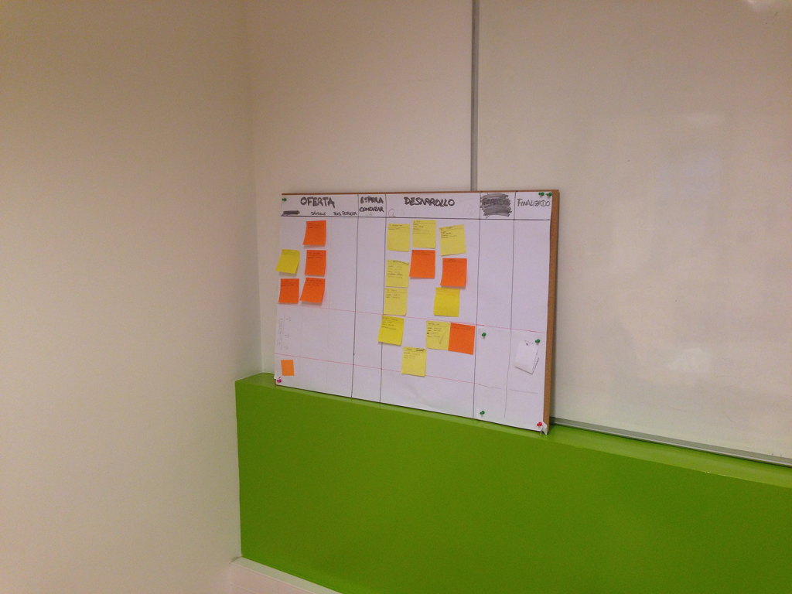
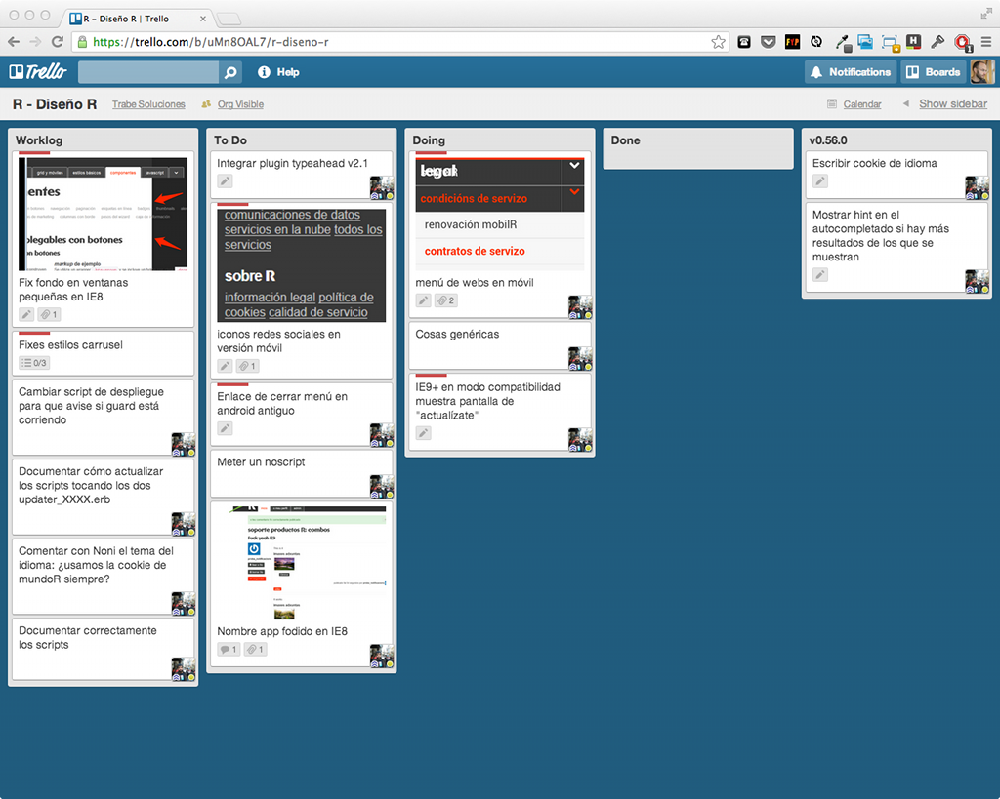
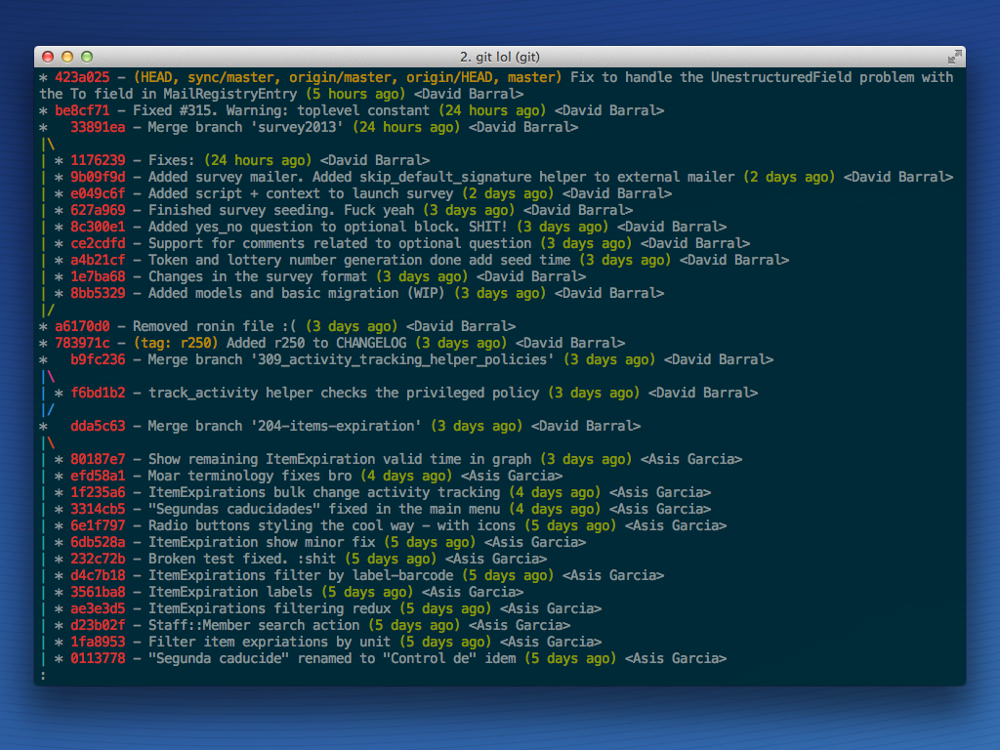
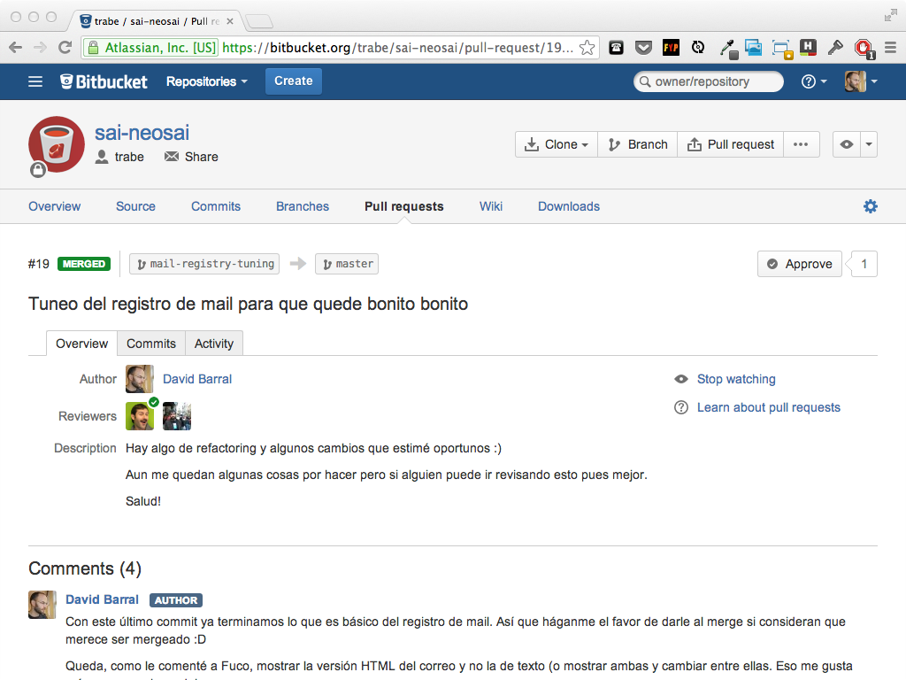
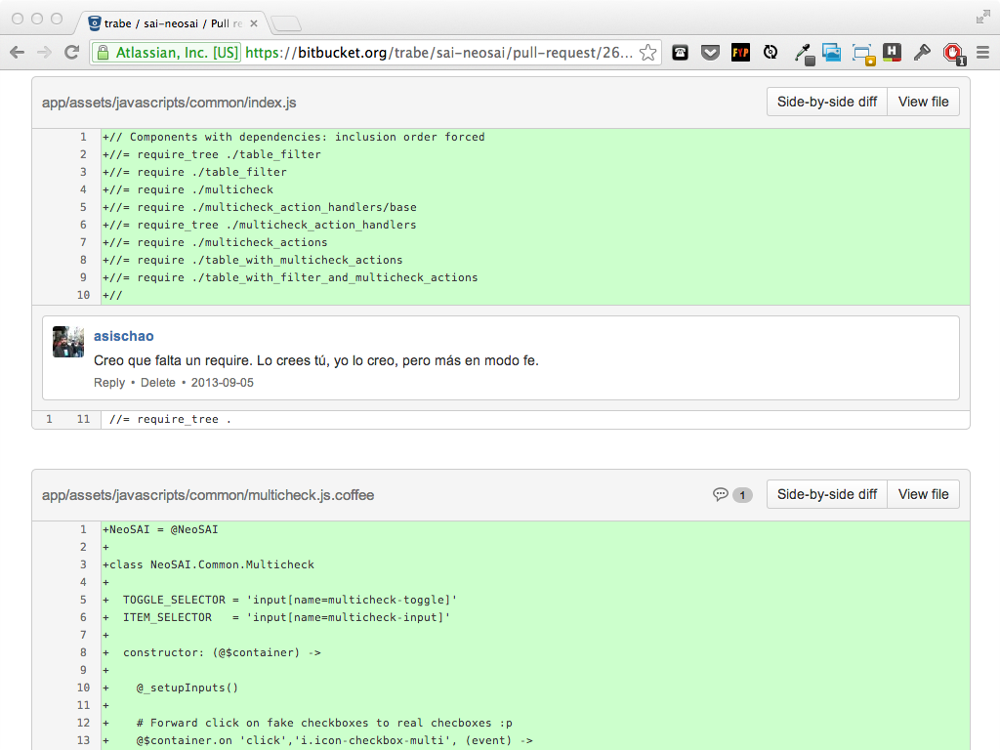
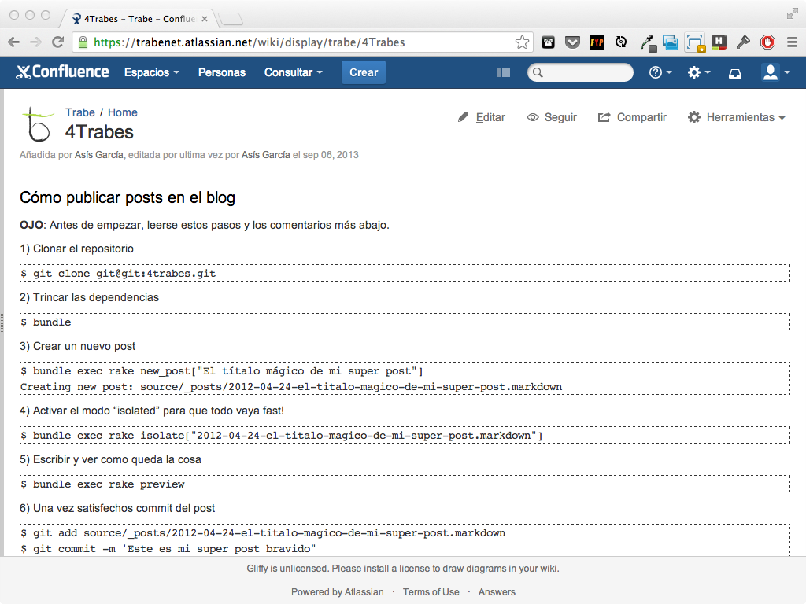
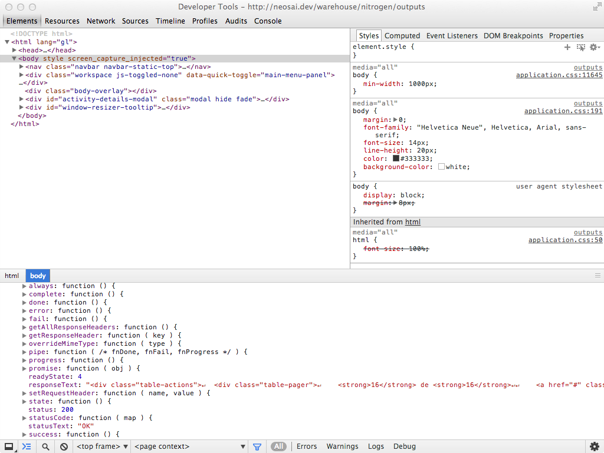

!SLIDE section

# Methodology

!SLIDE

# The Trábico process

## Agile, sort of : )

!SLIDE bullets bullets-first

# Project management

* Weekly meetings
* Kanban
* Postmortem

!SLIDE image

!SLIDE bullets many-bullets title-first

# Project development

* Kanban + Scrum (sort of)
* Continuous vs Scheduled delivery
* TDD
* Code reviews
* Pair programming

!SLIDE section

# Tools

!SLIDE image

!SLIDE image

!SLIDE image

!SLIDE image

!SLIDE image

<!--
  Diffs y comentarios permiten code reviews asíncronas y remotas
-->

!SLIDE image

<!--
  Compartir conocimiento. Preferir que el conocimiento específico 
  esté como parte del README del proyecto o similar.
-->

!SLIDE bullets bullets-first

* conventions
* automation
* scripts
* bootstrap

<!--
  Enforcing de convenciones de código comunes, etc. Entornos parecidos, herramientas y plugins comunes. .dotfiles en github
  Automatización de todo lo posible, setup, despliegue, tareas de mantenimiento
  Hacemos scripts. -> Repositorio de scripts compartido
  Facilitar el bootstrap del proyecto: README + script setup
-->

!SLIDE code small terminal

    @@@
    $ git clone trabe:awesome-client
    $ cd trabe:awesome-client
    $ ./bin/setup

!SLIDE bullets title-first
# TESTs, TESTs, TESTs

* Automatic run (guard)
* Mocking
* Metrics (coverage)

<!--
  Tests guiados por mocks, llevan al buen diseño
  Mock, Factorias, Mock de 3rd parties, coverage
  ¿¿Mockists vs State-ist??
  Deberíamos tener CI  (-_- U)
-->

!SLIDE bullets title-first
# Conveniences

* Transpilers: CoffeScript, SASS, etc.
* Debugging tools
* Live Reload. YAY!

<!--
  En función de la tecnología usamos herramientaa
  transpilers: escritura eficiente. Ojo al debug
  debugging: herramientas potentes como pry, etc,

-->

!SLIDE image

!SLIDE image

!SLIDE image

